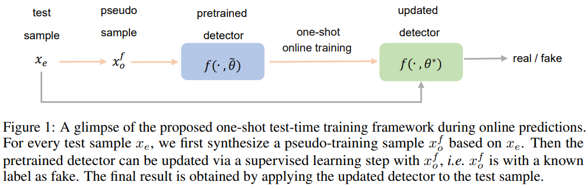

# OST: Improving Generalization of DeepFake Detection via One-Shot Test-Time Training

This repository contains PyTorch implementation of the NeurIPS paper:

> [OST: Improving Generalization of DeepFake Detection via One-Shot Test-Time Training](https://openreview.net/forum?id=YPoRoad6gzY). 
> 
> _Liang Chen, Yong Zhang, Yibing Song, Jue Wang, Lingqiao Liu_

A new learning paradigm specially designed for the deepfake detection task:



Preparation

#### pacakges, datasets, and running scripts
Same as that in [SLADD](https://github.com/liangchen527/SLADD):

#### pretrained weights
Download [Xception](https://drive.google.com/file/d/1A2EHgj7EW2RsfiqvtbnQSIvLkbVgDFlZ/view?usp=sharing) pretrained weights and [dlib](https://drive.google.com/file/d/1DB5-AsWHBpfprMccNt_6U0S1gl2L-5Zk/view?usp=sharing) landmark predictor and put them in the weights folder.

Citation
-
If you find this code useful for your research, please cite:
  ```
  @inproceedings{chen2022ost,
  title={OST: Improving generalization of deepfake detection via one-shot test-time training},
  author={Chen, Liang and Zhang, Yong and Song, Yibing and Wang, Jue and Liu, Lingqiao},
  booktitle={Advances in Neural Information Processing Systems},
  year={2022}}

  ```


Contact
-
Please emial me directly (<liangchen527@gmail.com>) if you have any questions or any feedback (since I no longer work on the deepfake detection task, issues in this project may not be properly resolved in time).
